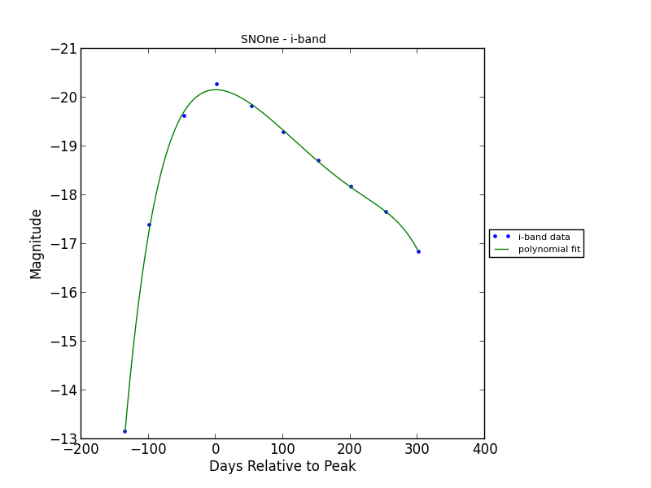

# Queen's University Belfast Imitation Transient Surveys (QUBITS)

## Abstract:

QUBITS can be used to simulate various flavours of astronomical transient surveys. The simulations are designed to be easy to use and tailor without having to hack any code, and many of simulation parameters can be found in one settings file.

Although recoded from scratch, the [second chapter of my thesis](qubits/assets/dry_thesis_ch2.pdf) describes most of the details used to build these transient survey simulations.

## Installation

The easiest way to install this code is to open your terminal and use the command:

    easy_install qubits

This should install the code and all of its dependencies (*dryxPython*,*matplotlib*,*numpy* ...).
Also make sure you have the `PYSYN_CDBS` path set in your path.

        setenv iraf "/usr/local/scisoft/packages/iraf/iraf"
        setenv IRAFARCH "macintel"
        setenv PYSYN_CDBS "/Volumes/hdd/project_archive/work_archive/reference/synphot_data"

I haven't tested this on other machines so let me know what goes wrong with the installation!  

If you want to tinker with the code and install qubits as a development package, then clone the project using this command:

    git clone git@github.com:thespacedoctor/qubits.git <folder_name>
    
and then `cd <folder_name>` and:

    python setup.py develop

## Usage ##

You run the code from the command-line using just one command. Open a terminal and use the following command syntax:

    Usage:
        qubits -s <pathToSettingsFile> -o <pathToOutputDirectory> -d <pathToSpectralDatabase>

        -h, --help      show this help message
        -s, --settings  provide a path to the settings file
        -d, --database  provide the path to the root directory containing your nested-folders and files spectral database
        -o, --output    provide a path to an output directory for the results of the simulations

## Building a Spectral Database

Within the folder you choose to place your spectral database, create appropriately named folders for each of the specific transient objects you would like to include in the simulations. Note these are the names to be included in the settings file (see below) and that will appear in results files, plots and logs.

    qubits_spectral_database/
        SNIa/
            t-021.00.spec
            t-012.00.spec
            t+003.00.spec
            t+015.00.spec
            t+024.00.spec
            t+068.00.spec
            t+098.00.spec
            t+134.00.spec
        SNIIp/
            ...
        SLSN/
            ...

Name your spectral files with times relative to some epoch within the transient's evolution (e.g. peak magnitude or explosion date). QUBITS will determine the time of peak magnitude when generating the lightcurves from the spectra and recalibrate the time scale relative to this point. The files should contain two space separated columns containing wavelength (Å) and flux (ergs/s/cm^2/Å).

## Settings File

The settings file for the simulations looks like this:

    version: 1
    author : Dave Young

    ##### PROGRAM EXECUTION SETTINGS #####
    Program Settings:
        # STAGE 1 - LIGHTCURVES
        Extract Lightcurves from Spectra: True
        # STAGE 2 - KCORRECTION DATABASE
        Generate KCorrection Database: True
        Generate KCorrection Plots: True  # ONLY SET TO TRUE IF ONLY A FEW KCORRECTIONS ARE TO BE CALCULATED
        # STAGE 3 - RUNNING SIMULATION
        Run the Simulation: True
        Plot Simulation Helper Plots: True  #  ONLY PLOT IF DEBUGGING
        # STAGE 4 - COMPILING RESULTS
        Compile and Plot Results: True
        Simulation Results File Used for Plots: simulation_results_20130919t131758.yaml

    ###### SIMULATED SURVEY CONSTRAINTS ######
    Extra Survey Constraints:
        Faint-Limit of Peak Magnitude: 21.50 # The lower-limit of the apparent peak magnitude so that the transient can be distinguished from other flavours of transients. Set this to 99.9 for this setting to be disregarded.
        Observable for at least ? number of days: 100 # Set this to 1 for this setting to be distregarded
    Lower Redshift Limit: 0.00 ## Usually set to 0.0
    Upper Redshift Limit: 1.0
    Redshift Resolution: 0.05 ## Higher resolution (lower number) means the simulations are more accuate but the code shall take long to run, especially for the k-correction database generation.
    Sky Area of the Survey (square degrees): 70
    Limiting Magnitudes:
        g : 23.3
        r : 23.3
        i : 23.3
        z : 21.7
    Survey Cadence:
        # YEAR MINUS FRACTION LOST DUE TO OBJECTS BEING LOCATED BEHIND THE SUN
        Observable Fraction of Year: 0.5
        Fraction of Year Lost to Weather etc: 0.4
        Filters:
            - band: g
              day of year of first scheduled observation: 1
              repeat every ? days: 3
              Fraction of Lunar Month Lost to Moon: 0.27
            - band: r
              day of year of first scheduled observation: 1
              repeat every ? days: 3
              Fraction of Lunar Month Lost to Moon: 0.27
            - band: i
              day of year of first scheduled observation: 2
              repeat every ? days: 3
              Fraction of Lunar Month Lost to Moon: 0.27
            - band: z
              day of year of first scheduled observation: 3
              repeat every ? days: 3
              Fraction of Lunar Month Lost to Moon: 0.27

    ###### K-CORRECTION GENERATION ######
    Rest Frame Filter for K-corrections: g # This is the filter that the k-corrections are anchored to. The simulations will convert from this observed band magnitude to the rest frame magnitudes to calculate the k-correction.
    K-correction temporal resolution (days): 1.0 # Only increase the resolution here if you have many spectra in your database and k-corrections are taking too long to generate.
    Order of polynomial used to fits k-corrections: 18 # Check the k-correction polynomial plots and tweak this value as needed.
    Minimum number of datapoints used to generate k-correction curve: 3 # If the are not enough spectra or too many spectra have been redshifted out of the range of the observed frame band-pass, then there are few points to generate a polynomial k-correction lightcurve. 3 is probably the barely-passable minimum.

    ###### SIMULATED UNIVERSE CONSTRAINTS ######
    CCSN Progenitor Population Fraction of IMF: 0.007
    Transient to CCSN Ratio: 10e-5
    Simulation Sample: 50 # Number of transients to include in simulations. More = more accurate but sims take longer to run. 100 good for testing & 10,000 good for science.
    Extinctions:
        constant or random: constant # Parameter not yet implemented - leave as `constant`
        constant E(b-v): 0.023 # 0.023 is the mean for the PS1-MD fields
        host: # Parameter not yet implemented
        galactic: # Parameter not yet implemented
    Relative Rate Set to Use: SLSNe
    Relative SN Rates:
        SLSNe:
            SN2007bi: 0.5 # make sure transient names correspond to folder names containing thier spectral data-sets
            SLSN: 0.5
    SN Absolute Peak-Magnitude Distributions:
        magnitude:
            SN2007bi: -17.08
            SLSN: -20.21
        sigma:
            SN2007bi: 0.001
            SLSN: 0.001

    ###### LIGHTCURVE GENERATION & CONSTRAINTS
    Lightcurves:
        SN2007bi:
            End of lightcurve relative to peak: 300 # Constrain the end of the lightcurve so polynomial fits don't go awal
        SLSN:
            End of lightcurve relative to peak: 220
    Order of polynomial used to fits lightcurves: 6 # Check the extracted lightcurve plots and tweak this value as needed.
    # Often it is useful to set a an explosion day (relative to the timescale used in naming the files in the spectral database).
    # This helps constrain the polynomials of the light- and K-correction- curves generated in the simulations.
    # SET TO `None` TO DISREGARD THIS SETTING
    Explosion Days:
        SLSN: -70
        SN2007bi: -70
    # You can also extend the tail of the lightcurve to better constrain the polynomial. Set to `True` or `False`
    Extend lightcurve tail?:
        SLSN: True
        SN2007bi: True

    ###### LOGGING
    Level of logging required: WARNING # DEBUG, INFO, WARNING, ERROR or CRITICAL

Download a template settings file from the [git repo here](tests/input/qubits_settings.yaml), adapt to your needs and then call it when running QUBITS (via the `-s` flag).

At the top of this settings file you turn the various stages of the simulation build on and off:

    Program Settings:
            # STAGE 1 - LIGHTCURVES
            Extract Lightcurves from Spectra: True
            # STAGE 2 - KCORRECTION DATABASE
            Generate KCorrection Database: True
            Generate KCorrection Plots: True  # ONLY SET TO TRUE IF ONLY A FEW KCORRECTIONS ARE TO BE CALCULATED
            # STAGE 3 - RUNNING SIMULATION
            Run the Simulation: True
            Plot Simulation Helper Plots: True  #  ONLY PLOT IF DEBUGGING
            # STAGE 4 - COMPILING RESULTS
            Compile and Plot Results: True
            Simulation Results File Used for Plots: simulation_results_20130919t131758.yaml

When you first use the simulations it's best to set all stages of the simulation to *False*, then incrementally run the code through each stage:

    * set the next setting to *True*, 
    * run the code, 
    * check the results and tweak settings and 
    * rerun if necessary
    * move onto the next stage and repeat. 

Below you will find details of each build stage of the simulation - read the settings file comments to determine which settings you need to tailor for the simulation you are trying to run.

### 1. Extracting the Lightcurves from Spectra

This stage will generate the lightcurves from the spectral files which you provide (at `<pathToSpectralDatabase>`). The extracted lightcurves are stored as python objects in the a file called *transient_light_curves.yaml* in `<pathToOutputDirectory>`.

Current filters are the PS1 *g*, *r*, *i*, *z* filters.

### 2. Generate K-Correction Database

The code will use the spectra to generate a database of K-corrections with the given settings. They will be created in the `k_corrections` directory of your output folder. For each redshift and k-correction filter-set a dataset is generated which is used to create a polynomial for *rest frame epoch* vs *kcorrection*.

By setting `Generate K-Correction Plots` to `True` a plot for each K-correction dataset will be generated. Set this to true if only a few k-corrections are to be calculated, i.e. when you are testing/debugging the simulation - otherwise the k-correction generation will take forever!

Do not be concerned if you see the following warning:

    does not have a defined binset in the wavecat table. The waveset of the spectrum will be used instead.

### 3. Run the Simulation

Here the simulation is run using the settings found in the settings file (cadence of observation, limiting-magnitudes, survey volume, loss due to weather etc). This stage is a two part process:

1. **Simulating the Universe** - placing SNe throughout the volume requested at random redshifts, with the relative-rate supplied and with the peak magnitude distributions given.
2. **Simulating the Survey** - simulates the survey with the setup supplied in the settings files with cadence of observation, limiting-magnitudes, survey volume, loss due to weather etc.

The results of the simulation are place in a (large) date-time stamped yaml file in the output folder with a name similar to `simulation_results_20130425t053500.yaml`. The date-time appended to the filename will be the time the simulation was run so you can run many simulations without worrying about overwriting previous outputs. The settings used to run the simulation are so recorded in this file.

The `Plot Simulation Helper Plots` setting should only be set to *True* if you are trying to debug the code and work out how the input data is being manipulated to create the simulations.

### 4. Compile and Plot Results

Use the `Simulation Results File Used for Plots` setting to set the simulation results file used to generate the result plots and log:

    Simulation Results File Used for Plots: simulation_results_20130425t053500.yaml

This compiles the results into a markdown file (plain text with minimal markup) and a styled HTML file into the `<pathToOutputDirectory>/results` folder with names similar to:

    simulation_result_log_20130426t110856.md
    simulation_result_log_20130426t110856.html

Here is an example of the output log file:

